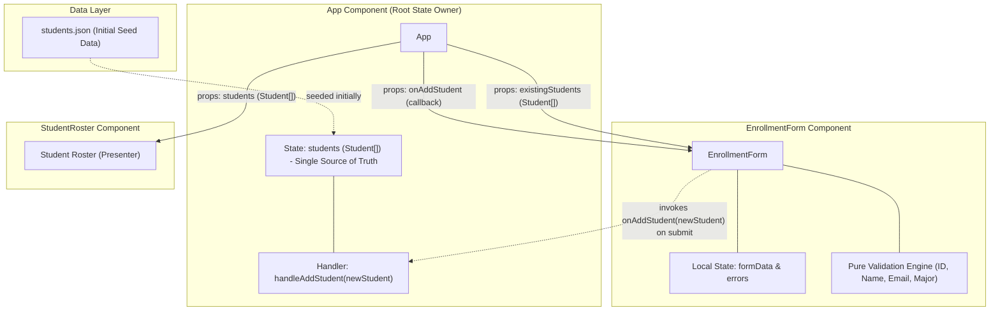
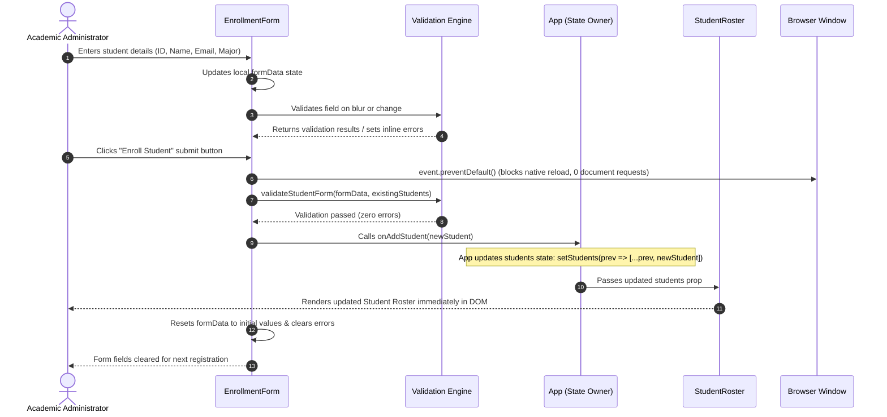

# CSR Student Portal

A modern, responsive Client-Side Rendered (CSR) Single-Page Application (SPA) for academic administrators to register students and manage academic rosters in real time with zero page reloads.

## Members
|Student ID|Name|
|-|-|
|24127052|Phùng Bảo Khang|
|24127345|Nguyễn Minh Đức|
|24127388|Hy Huê Hưng|

---

## Overview

The **CSR Student Portal** provides a lightweight, highly responsive interface for viewing and enrolling students. Traditional multi-page web applications suffer from disorienting full-page reloads, server document roundtrips, flash-of-unstyled-content (FOUC), and loss of transient form state.

This portal is implemented using a pure **Client-Side Rendering (CSR)** architecture:
- **Single Source of Truth**: The client-side React state is the authoritative data source throughout the session, initialized with pre-seeded students from [`src/data/students.json`](file:///home/pbkhang404/Documents/HCMUS/Y3/S1/web/team13-student-csr/src/data/students.json).
- **Instant Client-Side Validation**: Field inputs (Student ID format, duplicate ID uniqueness against roster, name length, email syntax, major selection) are validated in real time on change, blur, and submit.
- **Zero Document Requests**: Form submissions intercept default browser navigation via `event.preventDefault()`, directly updating client memory and immediately re-rendering the roster without HTTP document roundtrips.
- **Accessible & Modern UI**: Built with React 18, TypeScript, Tailwind CSS, and Vite, featuring responsive layouts, semantic HTML, and ARIA alert attributes.

---

## Architecture & State Ownership

The portal enforces a clean separation of concerns with a clear state ownership hierarchy:

- **Root `App` Component**:
  - Owns the primary `students` state (`Student[]`), initialized from `students.json`.
  - Exposes the state modifier callback `handleAddStudent(newStudent)`.
  - Distributes state down to child components via props (`students` to `StudentRoster`, `existingStudents` to `EnrollmentForm`).
- **`EnrollmentForm` Component**:
  - Owns local form state: `formData` (controlled input values) and `errors` (inline validation messages).
  - Validates fields against pure validation rules and checks uniqueness against `existingStudents`.
  - On valid submission, invokes the `onAddStudent` callback and resets local form fields to initial values.
- **`StudentRoster` Component**:
  - Stateless presentation component receiving `students` as props.
  - Renders the Student Roster, total count badges, and major badges.

### Component & State Ownership Diagram



---

## Submission Lifecycle & Data Flow

When a user registers a new student, the interaction lifecycle is processed completely on the client side:

1. **Input & Controlled State**: The administrator enters information into the `EnrollmentForm`. Input change handlers update the local `formData` state.
2. **Instant Feedback**: Blur and change events trigger pure validation routines, providing immediate inline visual feedback and clearing errors once corrected.
3. **Preventing Default Reload**: Upon clicking **Enroll Student**, `handleSubmit` calls `event.preventDefault()` to stop native browser form submission, guaranteeing zero HTTP document navigation.
4. **Final Validation**: Complete validation is executed. If errors exist, they are set to `errors` state and execution halts.
5. **State Mutation**: On passing validation, `onAddStudent(newStudent)` is dispatched to `App`, appending the new student to the `students` state via `setStudents(prev => [...prev, newStudent])`.
6. **Reactive Render**: `App` immediately passes the updated `students` array to `StudentRoster`, which re-renders the new student row instantly.
7. **Form Reset**: `EnrollmentForm` clears `formData` and `errors` back to their blank initial state, ready for the next entry.

### Submission Lifecycle Sequence Diagram



---

## Getting Started

### Prerequisites
- Node.js (version 18 or higher recommended)
- npm (bundled with Node.js)

### Installation

Clone the repository and install dependencies:

```bash
npm install
```

### Development Server

Start the local Vite development server with Hot Module Replacement (HMR):

```bash
npm run dev
```

Open your browser and navigate to `http://localhost:5173`.

### Running Tests

Execute the Vitest test suite covering schema, unit validation, component, and integration tests:

```bash
npm test
```

### Production Build

Type-check and bundle the application for production:

```bash
npm run build
```

The optimized static assets will be output to the `dist/` directory.

---

## Verification Guide: Confirming Zero Document Requests

To independently verify that the CSR Student Portal operates strictly on client-side state without triggering full-page reloads or HTTP document requests:

1. **Launch the Application**:
   Run `npm run dev` and open `http://localhost:5173` in Google Chrome or Chromium.
2. **Open Developer Tools**:
   Press `F12` (or `Ctrl+Shift+I` on Linux/Windows, `Cmd+Option+I` on macOS) to open Chrome DevTools.
3. **Navigate to the Network Tab**:
   Click on the **Network** tab in DevTools.
4. **Configure Network Filter & Logging**:
   - Ensure the filter type is set to **All** or **Doc** (Document).
   - Check the **Preserve log** checkbox (this ensures requests across any potential navigation would remain visible).
   - Click the **Clear** button (🚫) to empty previous network logs from the initial page load.
5. **Submit a New Student Enrollment**:
   In the **Enrollment Form**, enter:
   - **Student ID**: `24127999` (a valid 8-digit unique ID).
   - **Full Name**: `Jane Doe`.
   - **Institutional Email**: `24127999@student.hcmus.edu.vn`.
   - **Academic Major**: Select `Data Science`.
   Click **Enroll Student**.
6. **Observe the Results**:
   - **Instant UI Update**: The new student immediately appears at the bottom of the **Student Roster**, and the student count badge increments.
   - **Form Reset**: The form inputs immediately reset to blank default values.
   - **Network Inspection**: In the **Network** panel, **0 requests** of type `document` (or any XHR/Fetch document navigation requests) are sent. The network log remains completely empty, confirming that the form submission lifecycle was intercepted by `event.preventDefault()` and resolved entirely within client-side memory.
