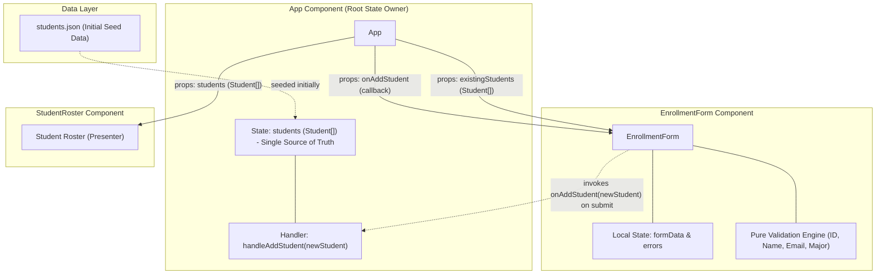
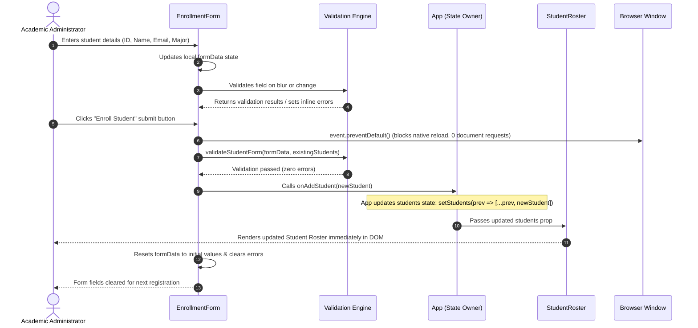

# System Architecture: CSR Student Portal

## Overview & Architectural Principles

The **CSR Student Portal** is designed around pure Client-Side Rendering (CSR) principles for high-interactivity Single-Page Applications (SPAs). It eliminates document-level page reloads, improves perceived latency to near zero, and keeps application state local and strictly controlled within React component hierarchies.

## Architectural Decision Records (ADRs)

### 1. Pure Client-Side Rendering (CSR)
- **Context**: Academic administrators need immediate feedback when validating and submitting student registrations. Full-page reloads disrupt focus, wipe transient errors or form field contents, and introduce server latency.
- **Decision**: Render everything on the client using React 18 and Vite. Forms intercept native browser submissions via `event.preventDefault()`.
- **Consequence**: No server roundtrips are incurred during enrollment actions. All state persists in memory throughout the user session.

### 2. State Ownership Hierarchy
- **Context**: Several components require access to student data (Student Roster, metrics, uniqueness check in enrollment form).
- **Decision**: The root component (`App`) serves as the single source of truth for the `students` collection. `EnrollmentForm` retains its own transient form state (`formData` and `errors`).
- **Consequence**: High cohesion, minimal prop-drilling, and clear unidirectional data flow.

### 3. Submission Lifecycle & Event Interception
- **Context**: Default browser form submission dispatches an HTTP POST/GET request that refreshes the window and drops client state.
- **Decision**: Attach an `onSubmit` handler to the `<form>` tag that immediately invokes `event.preventDefault()`.

## Validation Engine
Validation is decoupled into pure functions located in [`src/utils/validation.ts`](file:///home/pbkhang404/Documents/HCMUS/Y3/S1/web/team13-student-csr/src/utils/validation.ts):
- `validateStudentId(id, existingStudents)`: Validates 8-digit numeric requirement and guards against Uniqueness Violations.
- `validateStudentName(name)`: Validates non-empty and minimum 2 characters.
- `validateStudentEmail(email)`: Validates RFC-compliant email structure.
- `validateStudentMajor(major)`: Enforces membership in approved institutional majors.
- `validateStudentForm(formData, existingStudents)`: Aggregates errors across all fields for submit-time gating.
